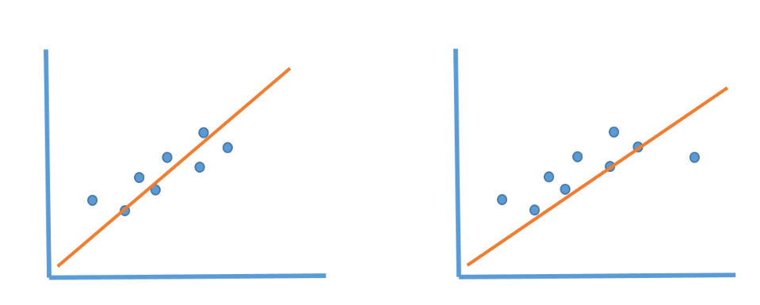

# Most Asked Interview Questions on linear regression.

###  1. Key Assumptions of Linear Regression 
- **Linearity**: Relation between the X (indpendent varibale) and mean of Y (dependent variable ) should be linear
For eg. In House price prediction, the plot of price over time is nearly a straight line. 

- **Homoscedasticity**: The spread or variance of errors should be roughly same for all X. For eg. Difference between the predicted and actual price don't change as house size increases.

- **Independence**:  Observations are Independent of each other . For eg While collecting data on heights of different people, the height of one person doesn't depend upon others.

- **Normality** : For any given value of X, Y should be Normally distributed 🔔(bell shape).For eg . Data at mean area occurs frequently then start and end 

These points should be satisfied before implementing linear regression.

 

###  2. Advantage 
1. Easy to implement and suitable for large datasets. 
2. Perform well for linearly seperable data.active
3. Base line for understing other complex models. 
3. Can handle overfitting using reduction techiniques and cross validation and regularizaiton.

-       model that's too simple (underfitting) and one that's too complex (overfitting),
-       Dimensionality reduction - reduce overfitting by selecting only the most relevant features (dimensions) of your data
-       cross validation : Split your dataset into multiple subsets for training and testing.
-       Regularization : Adding penalties to model complexity .
---

###  3. Disadvantages 

1. Sometimes Lot of Feature Engineering Is required . (transforming input features to improve accuracy)
2. If the independent features are correlated it may affect performance . (Eg. strong correlation between square foot and number of rooms)
3. It is often quite prone to noise and overfitting. (unreliable result on unseen data)
---
###  4. Whether Feature Scaling is required?
Yes, we need feature scaling in all Artificial Neural Networks
 
- Without feature scaling, gradient descent can be slow or may not converge.
- Feature scaling , helps to reach global minima very quickly 
Faster convergence, stable optimization, and better model performance.
 - Gradient Descent: It's an optimization technique used to find the best-fitting line (parameters) in linear regression.

- Common scaling methods include Min-Max scaling or Standardization (Z-score normalization).

###  5. Impact of Missing Values?
- It is sensitive to missing values , we have to handle missing value with feature enginnering 
- we can use imputation (mean , meadian to filling missing values) or removing rows/columns with missing data.

###  6. Impact of outliers?
linear regression needs the relationship between the independent and dependent variables to be linear. It is also important to check for outliers since linear regression is sensitive to outlier effects.

- Presence of outliners can change the position of regression line as shown in figure above , just to reduce mean square errors. 
- (Mean sqaure error) - is a performance metrics . like R square error 

###  7. Types of Problems it can solve(Supervised)
It us used to solve supervised learning problmes . In supervised learning , algorithm learns from labled data.

1. Predicting house prices based on features like size, location, and number of bedrooms.
2. Estimating a person's salary based on years of experience and education.
3. Forecasting sales revenue for a business based on advertising spend.
4. Predicting a student's exam score based on hours of study.
5. Estimating the price of a car based on its age, mileage, and other attributes.

### ###  8. Projects Using Linear Regression

1. **House Price Prediction:** Predict house prices based on features like size, location, and bedrooms.

2. **Salary Estimation:** Estimate salaries using years of experience, education, and other factors.

3. **Student Performance:** Predict student exam scores based on study hours, attendance, and grades.

4. **Stock Price Prediction:** Forecast stock prices using historical trading data.

5. **Crop Yield Prediction:** Predict crop yields based on weather and soil conditions.

6. **Energy Consumption:** Forecast energy consumption for efficient resource allocation.

7. **Customer Churn:** Estimate customer churn probabilities for retention strategies.

8. **Loan Default Prediction:** Predict loan default risks from applicant data.

9. **Real Estate Analysis:** Analyze real estate market trends and pricing fluctuations.

10. **Traffic Flow Prediction:** Predict traffic flow and congestion on road networks.

These project ideas cover a wide range of domains and applications for linear regression, providing opportunities for both learning and practical problem-solving.

###  9. Difference Between Simple Linear Regression and Multiple Linear Regression?

Answer: Simple linear regression involves one independent variable, while multiple linear regression deals with two or more independent variables to predict the dependent variable.

###  10. How to Interpret Coefficients in Linear Regression?

Answer: The coefficients represent the change in the dependent variable for a one-unit change in the corresponding independent variable, assuming all other variables remain constant.
###  11.What is the Residual Sum of Squares (RSS) in Linear Regression?

Answer: RSS is a measure of the total error between predicted and actual values in a linear regression model, used to assess model fit.
###  12.Difference Between R-squared and Adjusted R-squared?

Answer: R-squared measures the proportion of variance explained by the model, while adjusted R-squared adjusts for the number of predictors, providing a more reliable goodness-of-fit measure.

###  13. What is Multicollinearity?

Answer: Multicollinearity occurs when independent variables in a regression model are highly correlated, which can lead to unstable coefficient estimates.

###  14. What is Ridge Regression and Lasso Regression?

Answer: Ridge and Lasso regression are regularization techniques used to prevent overfitting by adding penalty terms to the linear regression cost function.

###  15. What is the Cost Function in Linear Regression?

Answer: The cost function, often Mean Squared Error (MSE), measures the error between predicted and actual values and is minimized during model training.

###  16 .Bias-Variance Tradeoff in Linear Regression?

Answer: The bias-variance tradeoff aims to balance model simplicity (bias) and flexibility (variance) to achieve optimal predictive performance.
###  17. Detecting and Handling Outliers in Linear Regression?

Answer: Outliers can be detected using statistical tests or visualization and treated by transforming, removing, or robust regression techniques.

### 18 . Different cases where we cannot apply linear regression ? 
some of the real life situations where linera regression may not be suitable are
1. **Spam Detection:** doesn't naturally handle binary classification task.
2. **Population Growth:** population growth follows exponential or logistic pattern which is not linear.

3. **Time series data:** Stock price Forecasating 

`Basically the main answer is we cann't use linear regression if the key assumptions are not satisfied .`

Referenced from different  sources from internet and video of [krish Naik](https://www.youtube.com/watch?v=eh-muwX6qbQ&list=PLZoTAELRMXVM0zN0cgJrfT6TK2ypCpQdY&index=2) 