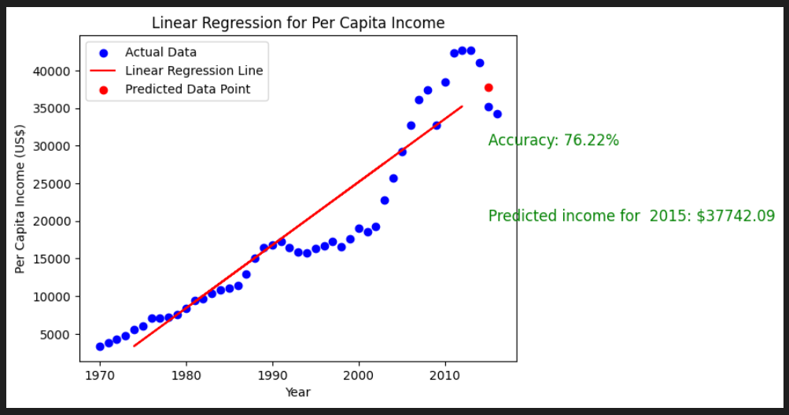

# FOllow these steps to run this project

### Importing the necessary libraries
- **pandas**: Used for data manipulation.
- **numpy**: Used for numerical computing and array operations.
- **matplotlib**: Used for data visualization.

```python
import pandas as pd 
import numpy as np 
import matplotlib.pyplot as plt 
%matplotlib inline
```

### Create a variable to hold your dataset 

```python
dataset = pd.read_csv('canada_per_capita_income.csv')
dataset.head()  # Display the contents of the dataset 
```

### Visualize the data 

```python
dataset.plot(x='year', y='per capita income (US$)', style='o')
plt.xlabel("area of land")
plt.ylabel("Price of land")
plt.show()
```

### Dataset Separation
- **x**: contains the independent variables (all columns except the last one).
- **y**: contains the dependent variable (last column in the dataset)

```python
x = dataset.iloc[:,:-1].values  # Select all rows and columns except the last column with index -1 
y = dataset.iloc[:,1].values     # Select all rows and the second column with index 1 
print(x)
```

### Split the dataset into training and testing sets
- **x_train:** data for training the model.
- **y_train:** corresponding target data for training.
- **x_test:** data for testing the model's performance.
- **y_test:** corresponding target data for testing.
- **test_size=0.2:** specifies 20% data for testing and 80% for training.
- **random_state=0:** set random seed for random number generator, 0 MEANS Data split will be reproducible

```python
from sklearn.model_selection import train_test_split

# Split the dataset into training and testing sets
x_train, x_test, y_train, y_test = train_test_split(x, y, test_size=0.2, random_state=0) 
```

### Fitting the training data using linear regression

```python
from sklearn.linear_model import LinearRegression
reg = LinearRegression()
reg.fit(x_train, y_train)
```

### Predicting the test data 

```python
y_pred = reg.predict(x_test)
y_pred
```

### Comparing the actual data with the test data 

```python
df = pd.DataFrame({'Actual': y_test, 'Predicted': y_pred})
df
```

### Show accuracy of prediction

```python
from sklearn.metrics import r2_score

# Calculate R-squared (R²) score
r_squared = r2_score(y_test, y_pred)
print("R-squared (R²) score:", r_squared)
```

### R-squared score measures how well the linear regression model fits the data, with values ranging from 0 to 1. A higher R-squared score indicates a better fit.

### Visualize the data and the linear regression line

```python
plt.scatter(x, y, color='blue', label='Actual Data')
plt.plot(x_test, y_pred, color='red', label='Linear Regression Line')
plt.xlabel('Year')
plt.ylabel('Per Capita Income (US$)')
plt.title('Linear Regression for Per Capita Income')
plt.legend()
plt.show()
```

### Accept the input from the user for prediction

```python
# Accept the user input for the year
user_year = int(input("Enter the year: "))

# Prepare the input data for prediction
user_input = np.array([[user_year]])

# Use the model to make a prediction
predicted_income = reg.predict(user_input)

# Display the predicted income to the user
print(f"Predicted per capita income for the year {user_year}: ${predicted_income[0]:.2f}")

# Visualize the data, linear regression line, and predicted data point
plt.scatter(x, y, color='blue', label='Actual Data')
plt.plot(x_test, y_pred, color='red', label='Linear Regression Line')
plt.scatter(user_year, predicted_income, color='red', marker='o', label='Predicted Data Point')
plt.xlabel('Year')
plt.ylabel('Per Capita Income (US$)')
plt.title('Linear Regression for Per Capita Income')
plt.legend()
plt.show()
```
